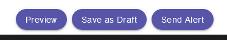
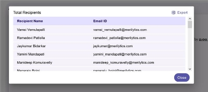
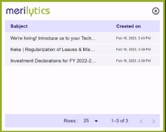

# **Version 1.0.0**

Desk Alerts internal communications solution is designed to deliver important messages to employees bypassing email and word-of-mouth, ensuring that the message is received, read, and acted upon in a timely manner.

Delivering the most crucial messages through a dedicated channel allows such organizations to rise above the flood of emails and keep everyone informed and engaged.

Desk Alerts system can be installed on-premises to keep your data close to home and ensure maximum security.

**Desktop alerts**

Desktop alerts are a perfect way to deliver your communications to staff in a way that can’t be accidentally missed or ignored on purpose. Pop-up windows will appear on targeted employees’ desktops, overlapping any other applications, and providing basic tracking capabilities.

This is how typical desktop alert may look like:

The desktop alert content isn’t limited by plain text - in fact, it can contain anything you could’ve put in the email otherwise - like images, tables, attached documents, hyperlinks to other sources of content or documentation, etc.

# **Creating a desktop alert**

To compose a desktop alert, one must possess an login for DeskAlerts Admin Panel. If this is the case, the main menu will feature *Alerts > Create* alert item for them.

Creating a desktop alert takes two main steps - composing the message and selecting the audience.

#### ***Selecting the message audience***

Each message sent from the DeskAlerts system doesn’t have to target the whole company - the audience can be limited to a few selected Active Directory objects, or groups available.

#### You will see a list of groups that can be searched as group sending is enabled

####

#### Enter the email ID of those if the alert is only for a specific employee and not a group

#### Another method for entering recipients allows you to copy and paste a list of email addresses from any text editor

#### *

#### ***Composing a message***

Message composition is done by entering a message in subject (like email subject) and content into the set of editors like shown on the screenshot below:

If the editor area doesn’t offer sufficient space for bulky content - feel free to use the Fullscreen mode (rightmost button).

Alerts can contain images, tables, links, and attached documents - see corresponding items on the content editor toolbars. The “Insert Image” and “Insert File” controls allow for file management using folders.

Content creators familiar with HTML can modify the source code of a message directly, enabling for more options, such as:

1. Creating responsive layouts
1. Embedding media objects, like <video> tags
1. Styling the content with CSS3 attributes beyond options offered by the editor toolbars.

***Note:** that the editor fully supports copy/pasting content from other sources, like Word documents.*

Use the Preview button (there’s one at the bottom) to verify that the content is being displayed in a way you need it to. The preview is the closest representation of how your message will appear on end-users’ screens, considering all selected settings and pop-up size.

***Note:** that slight differences between alert preview and resulting on-screen pop-up may exist:*

Pop-up alert has creation date displayed and slightly different styles may be applied depending on the receiving workstation configuration (font scaling, accessibility features, different OS than sender), so it’s common practice to send a message to yourself first before deploying it to a wider audience.

Then, you can proceed with selecting the message audience. After selecting audience if need to wait for further changes Click Save as Draft to continue. your unfinished message can be found in *Alerts > Draft* section of the menu.

If the list and message appear to be correct - hit the Send button (there’s one at the the bottom)

Once the “Send” button is clicked - the server will start distributing the messages to end-users. Depending on whether the message has a certain schedule set up, this may happen right away, or after a certain time.

Note that the message delivery delay to desktops may be anywhere from a few seconds to several minutes, depending on a client configuration.

# **Alert Dimensions**

Based on the need and the data we provide in the alert; dimensions can be adjusted. The default dimensions are 650 pixels wide by 450 pixels high. These dimensions cannot exceed 850 pixels wide and 550 pixels high, respectively.

**Scheduling**

**Scheduling** options let you create:

- Messages that won’t be sent out straight away.
- Messages that will arrive at a certain time in each time zone if you’re sending across regions.
- Messages that will recur, following a specified pattern, such as “deliver each Friday at 5PM until the end of time” .
- This is useful when you’re setting up notifications for scheduled maintenance or recurring activities.

#

# **Tracking of recipients**

By default, the DeskAlerts system keeps track of desktop and mobile alerts being deployed - gathering delivery confirmation information from desktop and mobile apps. These reports are available to any content creator or system admin with the “View Reports” policy.

Basic reporting (included with every DeskAlerts package) only gives you overall, percentage numbers, outlining how many people receive and acknowledge your messages, compared to the size of the targeted audience.

Each alert can be marked as “Received”, “Acknowledged” or “Not Received” by the end-user.

- **Unique Recipients**: all the unique recipients employee email Id’s are displayed.
- **Delivered:** status means that the message has been displayed by the client app (popped up on the desktop)
- **Not Delivered:** status means that the person targeted didn’t receive alert either wasn’t online on their desktop device.
- **Acknowledged:** status means that the end-user actively interacted with the message by scrolling to the bottom of it and clicking the OK button.
- **Not Acknowledged:** status means that the alert delivered to end-user but not acknowledged.
- **Actual Recipients:** all the actual recipients employee email Id’s  are displayed.

report for individual alert can be accessed by :

- By accessing alerts history from *Alerts > Sent* menu item, searching for your alert, then hitting the “info” icon in the Actions column. On click count of recipients pop up list is displayed and can be downloaded using Export icon in top most right corner.

# **DeskAlerts support Surveys**

DeskAlerts pop-up surveys are a great way to get feedback from your workforce within minutes when you need it urgently.

There are three main types of questionnaires you can create.

**Survey** is a set of questions that the recipients have to answer one by one, with the results only being available to the content creators who have access to DeskAlerts Reports. Use this if you need to keep the results secret from the recipients.

Once any type of survey is sent, it continues to gather responses until its schedule expires or it’s manually stopped by one of the admin panel users with the right to do so. After this, the survey is being automatically moved to Archive.

# **Survey options**

The survey arrives in the same manner as a Desktop alert

# **Question types**

There are four question types you can use in your surveys:

“**Single choice**” suggests a question with several answer options, only allowing the end-user to pick one.

“**Multiple choice**” suggests a question with several answer options, allowing each user to select as many as they like, with the minimum of one.

**“Linear scale**”

“**Text answer**” allows end-users to give extended text answer .

# **Download Responses**

We had the opportunity to download every response that was submitted with all of the information in Excel format.

Survey > Sent/Archived > View

Excel format:

|Recipient Name|Recipient Email ID|Subject|Question Name|Question Type|Answer|Acknowledge On|
| :- | :- | :- | :- | :- | :- | :- |

# **History**

The history tab contains a list of all the received alerts along with the time and date for each.

displaying the most recent alert first. By clicking on the subject of each alert, you can view it.

Task manager extension > desk alerts icon > right click m icon > History

                  
